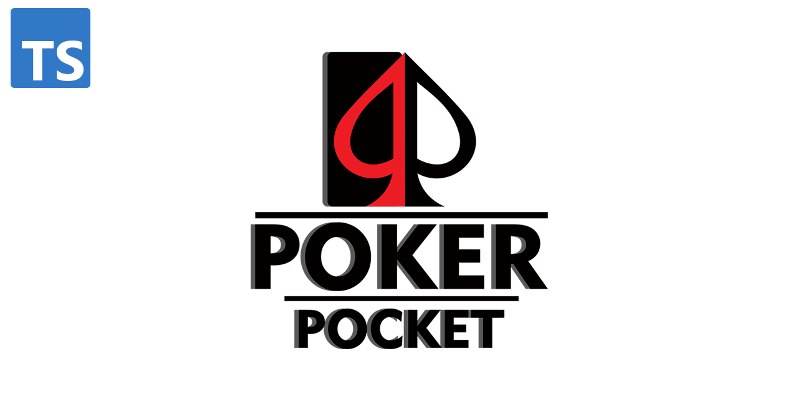

# Poker Pocket Typescript Backend

Nitramite Poker Pocket back end server was developed to run poker games. It's powering
[Nitramite Poker Pocket game](https://pokerpocket.nitramite.com/). This back end is pretty lightweight
and can run thousands of rooms easily.

This ts version replaces old js version https://github.com/norkator/poker-pocket-backend.

### Testing it out

Current staging: https://pokerpocket-staging.nitramite.com  
Current production: https://pokerpocket.nitramite.com

Get following front end client:

* React Web UI: https://pokerpocket-staging.nitramite.com
    * React Web UI source code: https://github.com/norkator/poker-pocket-react-client

### Prerequisites

* Download handRanks.dat file
  from: [https://github.com/christophschmalhofer/poker/blob/master/XPokerEval/XPokerEval.TwoPlusTwo/HandRanks.dat](https://github.com/christophschmalhofer/poker/blob/master/XPokerEval/XPokerEval.TwoPlusTwo/HandRanks.dat)  
  and place it under `/src` folder.

### Basic setup

1. Create database named `poker-pocket-ts` or define your own db name by setting env var `DB_NAME`
2. Add new schema into database called `poker`
3. Define and fill rest of env vars
    ```
    DB_HOST=<value>
    DB_USER=<value>
    DB_PASS=<value>
    DB_NAME=<value, by default poker-pocket-ts>
    ```
4. Define secrets
    * Define env var `PW_SECRET=<value>` and get value using `npm run secret`
    * Define env var `PW_REFRESH_SECRET=<value>` and get value using `npm run secret`
5. Run `npm install`
6. Run `npm run start:dev` on development environment (uses nodemon)
7. Backend is now running.
8. Set up frontend https://github.com/norkator/poker-pocket-react-client

### AI LLM Addon

* https://github.com/norkator/poker-pocket-ai-provider

### Note

`.gitignore` file is set to ignore `HandRanks.dat` which is big file.

## Authors

* **Martin Kankaanranta** - *Initial work* - [norkator](https://github.com/norkator)

## Contributors

None for ts version.

For old js version which this repository is based:

### [shrpne](https://github.com/shrpne)

* [Commits](https://github.com/norkator/poker-pocket-backend/commits?author=shrpne)

### [linus2code](https://github.com/linus2code)

* [Commits](https://github.com/norkator/poker-pocket-backend/commits?author=linus2code)
* Created [React version](https://github.com/linus2code/poker-pocket-react-client) of Web UI

## License

MIT
